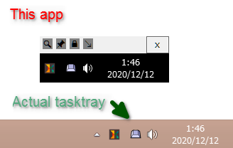
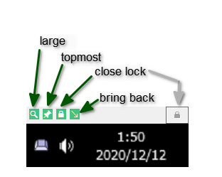

# SystemTrayMirrorWin

Display mirror of system tray icons to check notification even if taskbar was hidden. Only display.

It is also useful when you want to see the task tray of the connected Windows when you are using Remote Desktop in full screen mode for remote work.

# window

This application shows you your system tray icons (formally notification area).

You can see clock and icon even if you hide taskbar.

This app only display icons. You can't click them.

---

システムトレイ(通知領域)のアイコンと時計を表示するアプリケーションです。

タスクトレイが自動で隠れる設定であったり、タスクトレイがウィンドウに隠れていても表示されます。

リモートワーク等でリモートデスクトップを全画面で利用しているとき、接続元Windowsのタスクトレイが見たい場合などにも役立ちます。

# toggle buttons

There are 3 buttons in the left top of the window.

* large : toggle zoom.
* topmost : toggle window topmost.
* close lock : guard close button from click mistake.
* bring back : removed on ver 2.0

---

3つのトグルボタンがあります。

* large : 拡大表示します。1.5倍にした気がする。
* topmost : 常に全面表示。
* close lock : × ボタンを押せなくします。間違ってクリックして閉じてしまうのを防ぐためだけで、タスクトレイとかからは普通に閉じれます。
* bring back : バージョン２で削除しました。
